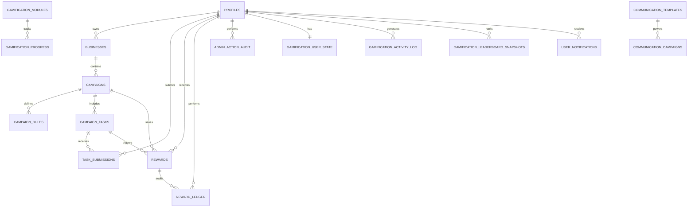

# Production Blueprint

## Readiness Check

The platform is production-shaped and close to release-ready on the current implementation stack. It already has role-based routing, Supabase Auth, database-driven configuration, RLS-first security, modular feature boundaries, deployment documentation, and a validated operations path through Netlify.

One correction is important: the workspace implementation is React + Vite, not Next.js. If Next.js is a hard requirement, that is a migration decision, not a documentation change. The blueprint below is the production architecture target for the business marketing platform and matches the current domain model, while remaining modular enough for future expansion.

## 1. Database Schema

The schema should be normalized around identity, business ownership, campaign execution, reward accounting, administration, and operational auditability.

### Core tables

- `profiles`
- `businesses`
- `campaigns`
- `campaign_rules`
- `campaign_tasks`
- `task_submissions`
- `rewards`
- `reward_ledger`
- `admin_action_audit`
- `platform_settings`

### Growth and engagement tables

- `gamification_modules`
- `gamification_user_state`
- `gamification_progress`
- `gamification_activity_log`
- `gamification_leaderboard_snapshots`

### Communication and CMS tables

- `communication_templates`
- `communication_campaigns`
- `user_notifications`
- CMS page and content tables for public and authenticated surfaces

### Design rules

- Use UUID primary keys everywhere.
- Use enum or constrained text fields for lifecycle states and roles.
- Store flexible configuration in `jsonb` only where the schema must remain dynamic.
- Make append-only audit and ledger tables immutable.
- Index every foreign key and every high-cardinality filter column.
- Enforce ownership, visibility, and mutation rules with RLS rather than UI-only checks.

## 2. ER Diagram



## 3. Folder Structure

Use a feature-first modular structure with shared primitives isolated from business logic.

```text
platform/
├── components/
├── features/
├── services/
├── hooks/
├── pages/
├── lib/
├── database/
├── admin/
├── user/
├── api/
├── public/
└── styles/
```

### Recommended substructure

- `components/` for reusable UI primitives, layout atoms, and shared composites.
- `features/` for domain modules such as auth, campaigns, analytics, rewards, CMS, and communication.
- `services/` for Supabase clients, typed data access, and integration wrappers.
- `hooks/` for shared React hooks and authorization helpers.
- `pages/` for route entry points and page composition.
- `lib/` for constants, validation, permissions, logging, and utility helpers.
- `database/` for SQL migrations, RLS, seeds, and schema documentation.
- `admin/` for admin-specific compositions and workflows.
- `user/` for authenticated user flows and dashboards.
- `api/` for server-side endpoints, webhooks, and future integrations.

## 4. Authentication Flow

### Flow

1. Guest lands on public pages and can browse limited content.
2. User signs in or signs up through Supabase Auth.
3. Auth triggers create or update the profile row in `profiles`.
4. The app loads the profile, role, and status from the database.
5. Route guards and UI guards resolve the correct shell for the user.
6. RLS policies enforce the same permission model at the database layer.

### Role model

- `super_admin`
- `admin`
- `advertiser`
- `business_owner`
- `user`
- `guest`

### Access rules

- `guest` can access public content only.
- `user` can access authenticated user dashboards, submissions, rewards, and profile features.
- `business_owner` can manage business records, campaigns, and campaign reporting.
- `advertiser` can manage campaign creation and performance workflows.
- `admin` can manage content, users, moderation, communications, and platform settings.
- `super_admin` has full platform authority.

## 5. API Architecture

The platform should be API-ready from day one, even if much of the data access currently runs through Supabase client calls.

### Layers

- Presentation layer: pages and feature components.
- Domain layer: feature modules with business rules.
- Service layer: typed functions that wrap data access.
- Transport layer: API routes, server actions, edge functions, or webhooks.
- Data layer: PostgreSQL via Supabase.

### Contract rules

- Keep API payloads typed and versioned.
- Separate read models from write models where needed.
- Expose server-side operations only through trusted endpoints.
- Use Supabase Edge Functions for scheduled tasks, webhooks, and privileged workflows.
- Keep frontend code limited to anon-key-safe operations.
- Prefer a thin RPC or edge-function layer for queue processing, notification retries, and any privileged delivery workflow.
- Schedule delivery jobs from Supabase cron or an edge-function scheduler rather than from the browser.

### Suggested endpoint groups

- `/api/auth/*` for session-adjacent utilities and callbacks.
- `/api/campaigns/*` for campaign lifecycle and reporting.
- `/api/rewards/*` for reward issuance and claims.
- `/api/admin/*` for administrative workflows.
- `/api/webhooks/*` for third-party callbacks and async events.

## 6. Security Architecture

Security should be enforced in layers, not assumed in one place.

### Controls

- Supabase Auth for identity.
- RLS on every table that stores user, campaign, reward, or admin data.
- Service-role credentials only in trusted server-side contexts.
- Role checks in the UI for usability, not as the primary security boundary.
- Input validation with schema-based validation before persistence.
- Audit logging for admin actions, reward changes, and high-risk workflows.
- Storage policies that scope access to owner or role-specific buckets.
- Environment variables for every environment-specific secret and endpoint.

### Threat areas to cover

- Unauthorized data access
- Privilege escalation
- Duplicate reward issuance
- Fraudulent campaign submissions
- Storage bucket exposure
- Environment secret leakage
- Open redirect and callback abuse

## 7. Deployment Architecture

### Topology

- GitHub is the source of truth.
- Netlify hosts the frontend application and deploy previews.
- Supabase hosts auth, PostgreSQL, storage, and edge functions.
- GitHub Actions runs lint, typecheck, tests, and build validation before release.

### Release flow

1. Merge to a protected branch.
2. Run CI validation.
3. Apply database migrations.
4. Promote the frontend build to Netlify production.
5. Verify auth, routes, RLS, storage, and analytics in production.
6. Verify queue-processing cron or scheduled function execution and confirm notification delivery rows move from `queued` to `sent`.

### Notification delivery pattern

- User notices should be created immediately for withdrawal events.
- If a workflow depends on a fixed date, store that date on the source record and display it in the message body, but do not defer the notice itself.
- Admin-facing alerts should be emitted immediately and should include the source record id, effective limit, and date metadata.

### Environment variables

- `VITE_SUPABASE_URL`
- `VITE_SUPABASE_ANON_KEY`
- `VITE_APP_ENV=production`
- `NETLIFY_AUTH_TOKEN`
- `NETLIFY_SITE_ID`

### Production criteria

- Mobile responsive layouts validated on real devices.
- Dark and light mode supported through tokens, not one-off overrides.
- No hard-coded secrets.
- CI gates all production changes.
- Migrations are applied before dependent UI features ship.
- Observability exists for runtime failures and admin operations.

## Conclusion

This is a solid production architecture for a modular business marketing platform. It is already aligned with scalable SaaS patterns: feature isolation, typed services, RBAC, secure auth, RLS, and deployment discipline. The only major mismatch with your stated target stack is Next.js versus the current Vite implementation. If you want strict Next.js compliance, that should be treated as a planned migration; otherwise, the existing platform architecture is production-ready with normal hardening and test coverage expansion.
